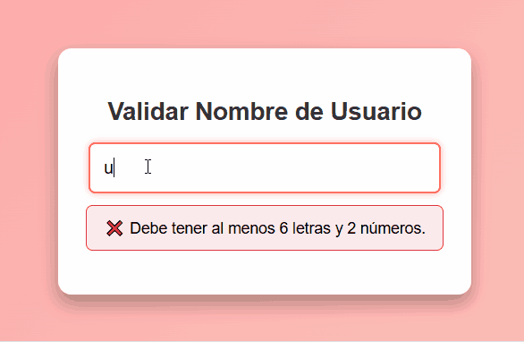

**4.1.6.** Crea un input en el que se introduzca un nombre de usuario y que se verifique en tiempo real (usa el evento `oninput`) que posee 6 letras y 2 números:



**4.3.1.** Crear un reloj digital que muestre la hora actual y cambie de color cada segundo:


**4.3.2.** Crea una página web donde aparezca un botón que, al ser presionado, inicie un temporizador. Este temporizador hará que un círculo en la pantalla se mueva de izquierda a derecha y cambie de color cada segundo. Si el usuario hace clic en el círculo, el temporizador se detiene y se muestra un mensaje.


**4.3.3.** Crea una página web que simule el funcionamiento de un semáforo. El semáforo tiene tres luces: roja, amarilla y verde. Cada luz se ilumina durante un periodo de tiempo específico (por ejemplo, 3 segundos para rojo, 1 segundo para amarillo y 3 segundos para verde). El semáforo comienza automáticamente al cargar la página, pero debe haber un botón para pausar y otro para reiniciar el ciclo. Se incluye un código HTML con los estilos que puedes usar de referencia.


```html
<!DOCTYPE html><html>
<head>
   <title>Semáforo Interactivo</title>
   <style>
       body {
           font-family: Arial, sans-serif;
           text-align: center;
           margin: 0;
           padding: 20px;
           background-color: #f4f4f4;
       }

       #semaforo {
           display: flex;
           flex-direction: column;
           align-items: center;
           justify-content: space-around;
           width: 100px;
           height: 300px;
           margin: 20px auto;
           border: 5px solid #333;
           border-radius: 15px;
           background-color: #333;
       }


       .luz {
           width: 70px;
           height: 70px;
           border-radius: 50%;
           background-color: gray;
           transition: background-color 0.5s ease;
       }


       #rojo.activo {
           background-color: red;
       }


       #amarillo.activo {
           background-color: yellow;
       }


       #verde.activo {
           background-color: green;
       }


       button {
           margin: 10px;
           padding: 10px 20px;
           font-size: 16px;
           cursor: pointer;
           border: none;
           border-radius: 5px;
       }


       button:hover {
           background-color: #ddd;
       }


       #pausar {
           background-color: #f77;
       }


       #reiniciar {
           background-color: #7f7;
       }
   </style>
</head>
<body>
   <h1>Semáforo Interactivo</h1>
   <div id="semaforo">
       <div id="rojo" class="luz"></div>
       <div id="amarillo" class="luz"></div>
       <div id="verde" class="luz"></div>
   </div>
   <button id="pausar">Pausar</button>
   <button id="reiniciar">Reiniciar</button>
</body></html>
```


**4.3.4.** Se pide implementar el juego del alien. Busca dos imágenes que representen un **alien** y un **alienMuerto**. Construye un juego en el que vaya cayendo un alien por la pantalla. Al hacer clic sobre él, se cambia su imagen a alienMuerto y se suma un punto. La velocidad aumenta conforme más aliens se matan. Se pierde cuando algún alien llega a la parte inferior de la pantalla. Observa el comportamiento en la animación que se ofrece.


**Pasos recomendados**:
1. Crear alien en posición aleatoria.
2. Eliminar todos los elementos de la partida anterior (si los hay).
3. Mover el alien hacia abajo.
4. Gestionar fin del juego (condición de fin y mensaje en pantalla)
5. Gestionar clic sobre alien (eliminación del alien y creación de alienMuerto).


Se os da la siguiente fichero HTML que PODÉIS MODIFICAR para construir el juego:

```html
<!DOCTYPE html><html>
<head>
   <title>Juego del Alien</title>
   <style>
       #zonaJuego {
           position: relative;
           width: 800px;
           height: 600px;
           border: 1px solid black;
           overflow: hidden;
       }
       .alien {
           position: absolute;
           width: 42px; /* Consultamos el tamaño en el fichero original */
           height: 81px;
           background-image: url(alien.png);
           background-size: contain;
           background-repeat: no-repeat;
       }
       #puntos {
           font-size: 24px;
       }
       #textoGameOver {
           visibility: hidden;
           font-size: 48px;
           color: red;
           position:absolute;
           margin: 250px 200px;
           z-index: 3; /* Para quedar por encima de los demás objetos del juego */
       }


       .alienMuerto {               
               width: 45px; /* Ponemos el tamaño del fichero original */
               height: 40px;
               background-image: url(alienMuerto.png);
               background-size: contain;
               background-repeat: no-repeat;
               position: absolute;
              
           }
   </style>
</head>
<body>
   <button id="botonComenzar">Empezar</button>
   <div id="puntos">Puntos: 0</div>
   <div id="textoGameOver">¡GAME OVER!</div>
   <div id="zonaJuego"></div>
   <div id="alienMuerto"></div>


   <script src="juego.js"></script>
</body></html>
```
