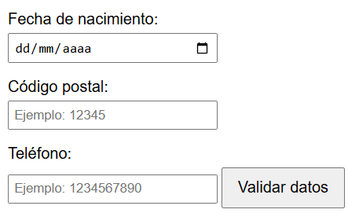
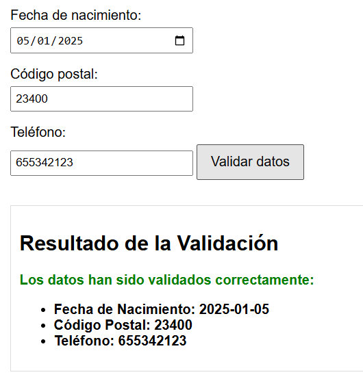

**5.4.1.** Usando el servicio PHP que se indica a continuación, crea una página web que contenga el botón "Consulta" y campo de tipo **select** vacío. Al pulsar este botón **Consulta** se hará lo siguiente: 
- Si el select está vacío deberá realizarse una petición AJAX a la siguiente dirección http://localhost/productos.php/products. Con la respuesta proporcionada deberá cargarse en un select los nombres de todos los productos.
- En el caso de estar relleno el select, se seleccionará un producto y deberá realizarse una petición AJAX pasando como parámetro el id del producto del cual queremos consultar los datos (http://localhost/productos.php/products/1). Se deberán mostrar los datos del producto consultado en una tabla html. 

El siguiente código debes guardarlo en un fichero con nombre `productos.php` y colocarlo en tu carpeta del servidor web con PHP:

```php
<?php
// Establecer el encabezado de respuesta para indicar que estamos devolviendo JSON
header('Content-Type: application/json');
// Habilitar CORS para permitir solicitudes desde cualquier origen
header('Access-Control-Allow-Origin: *'); // Permite cualquier origen, puedes restringirlo a un dominio específico si lo prefieres

// Habilitar los métodos permitidos (GET, POST)
header('Access-Control-Allow-Methods: GET');

// Permitir el encabezado Content-Type (y otros encabezados necesarios) en la solicitud
header('Access-Control-Allow-Headers: Content-Type');

// Datos de ejemplo (simulando la respuesta de la API)
$productos = [
    [
        "id" => 1,
        "name" => "Auriculares Bluetooth",
        "category" => "Electrónica",
        "price" => 49.99,
        "available" => npmtrue,
        "description" => "Auriculares inalámbricos con sonido de alta calidad y batería de larga duración."
    ],
    [
        "id" => 2,
        "name" => "Cafetera Espresso",
        "category" => "Hogar",
        "price" => 129.99,
        "available" => false,
        "description" => "Cafetera automática con molinillo integrado y múltiples configuraciones."
    ],
    [
        "id" => 3,
        "name" => "Mochila de Viaje",
        "category" => "Accesorios",
        "price" => 79.50,
        "available" => true,
        "description" => "Mochila resistente al agua con gran capacidad y compartimento para portátil."
    ],
    [
        "id" => 4,
        "name" => "Smartphone Pro",
        "category" => "Electrónica",
        "price" => 899.99,
        "available" => true,
        "description" => "Teléfono inteligente con cámara de alta resolución y pantalla AMOLED."
    ],
    [
        "id" => 5,
        "name" => "Zapatillas Deportivas",
        "category" => "Calzado",
        "price" => 59.99,
        "available" => true,
        "description" => "Zapatillas ligeras y cómodas, ideales para correr y entrenar."
    ],
    [
        "id" => 6,
        "name" => "Juego de Ollas",
        "category" => "Hogar",
        "price" => 199.99,
        "available" => false,
        "description" => "Set de ollas de acero inoxidable con tapas de vidrio y mangos ergonómicos."
    ]
];

// Obtener la URI solicitada
$requestUri = $_SERVER['REQUEST_URI'];

// Obtener solo la ruta (sin parámetros de consulta)
$uriParts = parse_url($requestUri);
$path = $uriParts['path'];

// Verificamos si la URI es "/products"
if (preg_match('#^/productos.php/products/?$#', $path)) {
    // Si no se ha especificado un ID (por ejemplo: /products), devolver todos los productos
    echo json_encode($productos);
}
// Si se ha especificado un ID (por ejemplo: /products/1), devolver ese producto
elseif (preg_match('#^/productos.php/products/(\d+)$#', $path, $matches)) {
    $id = (int)$matches[1];
    $producto = null;

    foreach ($productos as $item) {
        if ($item['id'] == $id) {
            $producto = $item;
            break;
        }
    }

    if ($producto) {
        echo json_encode($producto);
    } else {
        // Si no se encuentra el producto, devolver error 404
        header("HTTP/1.1 404 Not Found");
        echo json_encode(["message" => "Producto no encontrado"]);
    }
} else {
    // Si la URI no es válida, devolver error 404
    header("HTTP/1.1 404 Not Found");
    echo json_encode(["message" => "Ruta no encontrada"]);
}
?>
```


**5.4.2** Diseña un formulario como el siguiente: 



Al pulsar el botón se debe llamar (usando AJAX) a una página PHP creada en tu servidor enviándole como parámetros de la petición los valores introducidos en los 3 campos. La página PHP deberá validar los datos y enviar una respuesta al cliente (en formato HTML) de modo que éste mostrará el resultado de la petición de un modo similar al siguiente: 



Envía los parámetros usando POST y usa la clase URLSearchParams de la que se aporta un ejemplo de uso:
```javascript
// Datos a enviar
const datos = {
  id: "1990",
  altura: 135
};

// Convertir los datos a URLSearchParams
const parametros = new URLSearchParams(datos);

// Realizar la solicitud POST al servidor
fetch("http://localhost/tu_script.php", { 
  method: "POST",
  headers: {
    "Content-Type": "application/x-www-form-urlencoded",
  },
  body: parametros.toString(), // Convertir los parámetros a una cadena de consulta
})
```

El siguiente código debes guardarlo en un fichero con nombre `procesar_datos.php` y colocarlo en tu carpeta del servidor web con PHP:

```php
<?php

// Permitir solicitudes desde cualquier origen
header("Access-Control-Allow-Origin: *");
// Permitir métodos específicos (en este caso, POST)
header("Access-Control-Allow-Methods: POST");
// Permitir ciertos encabezados
header("Access-Control-Allow-Headers: Content-Type");

// Validar que sea una solicitud POST
if ($_SERVER['REQUEST_METHOD'] === 'POST') {
    // Recibir los datos enviados
    $fechaNacimiento = $_POST['fechaNacimiento'] ?? '';
    $codigoPostal = $_POST['codigoPostal'] ?? '';
    $telefono = $_POST['telefono'] ?? '';

    // Validar campos
    $errores = [];

    if (empty($fechaNacimiento)) {
        $errores[] = "La fecha de nacimiento es obligatoria.";
    }

    if (empty($codigoPostal) || !preg_match('/^[0-9]{5}$/', $codigoPostal)) {
        $errores[] = "El código postal debe tener 5 dígitos.";
    }

    if (empty($telefono) || !preg_match('/^[0-9]{9}$/', $telefono)) {
        $errores[] = "El teléfono debe tener 9 dígitos.";
    }

    // Generar respuesta en HTML
    echo "<h2>Resultado de la Validación</h2>";

    if (count($errores) > 0) {
        echo "<ul style='color: red;'>";
        foreach ($errores as $error) {
            echo "<li>$error</li>";
        }
        echo "</ul>";
    } else {
        echo "<p style='color: green;'>Los datos han sido validados correctamente:</p>";
        echo "<ul>";
        echo "<li><strong>Fecha de Nacimiento:</strong> $fechaNacimiento</li>";
        echo "<li><strong>Código Postal:</strong> $codigoPostal</li>";
        echo "<li><strong>Teléfono:</strong> $telefono</li>";
        echo "</ul>";
    }
} else {
    // Respuesta para métodos no permitidos
    echo "<h2>Resultado de la Validación</h2>";
    echo "<p style='color: red;'>Método no permitido. Por favor, use el formulario para enviar los datos.</p>";
}
?>
```


**5.4.3** Repite el ejercicio anterior, pero usando JSON. Para ello, se proporciona el código del servidor adaptado a usar JSON:

```php
<?php
// Permitir solicitudes desde cualquier origen
header("Access-Control-Allow-Origin: *");
// Permitir métodos específicos (en este caso, POST)
header("Access-Control-Allow-Methods: POST");
// Permitir ciertos encabezados
header("Access-Control-Allow-Headers: Content-Type");
// Establecer el tipo de contenido como JSON
header("Content-Type: application/json");

// Validar que sea una solicitud POST
if ($_SERVER['REQUEST_METHOD'] === 'POST') {
    // Obtener los datos JSON del cuerpo de la solicitud
    $data = json_decode(file_get_contents('php://input'), true);

    $fechaNacimiento = $data['fechaNacimiento'] ?? '';
    $codigoPostal = $data['codigoPostal'] ?? '';
    $telefono = $data['telefono'] ?? '';

    // Validar campos
    $errores = [];

    if (empty($fechaNacimiento)) {
        $errores[] = "La fecha de nacimiento es obligatoria.";
    }

    if (empty($codigoPostal) || !preg_match('/^[0-9]{5}$/', $codigoPostal)) {
        $errores[] = "El código postal debe tener 5 dígitos.";
    }

    if (empty($telefono) || !preg_match('/^[0-9]{9}$/', $telefono)) {
        $errores[] = "El teléfono debe tener 9 dígitos.";
    }

    // Generar respuesta JSON
    if (count($errores) > 0) {
        echo json_encode([
            'exito' => false,
            'errores' => $errores
        ]);
    } else {
        echo json_encode([
            'exito' => true,
            'mensaje' => 'Los datos han sido validados correctamente.',
            'datos' => [
                'fechaNacimiento' => $fechaNacimiento,
                'codigoPostal' => $codigoPostal,
                'telefono' => $telefono
            ]
        ]);
    }
} else {
    // Respuesta para métodos no permitidos
    echo json_encode([
        'exito' => false,
        'mensaje' => 'Método no permitido. Por favor, use el formulario para enviar los datos.'
    ]);
}
?>

```
